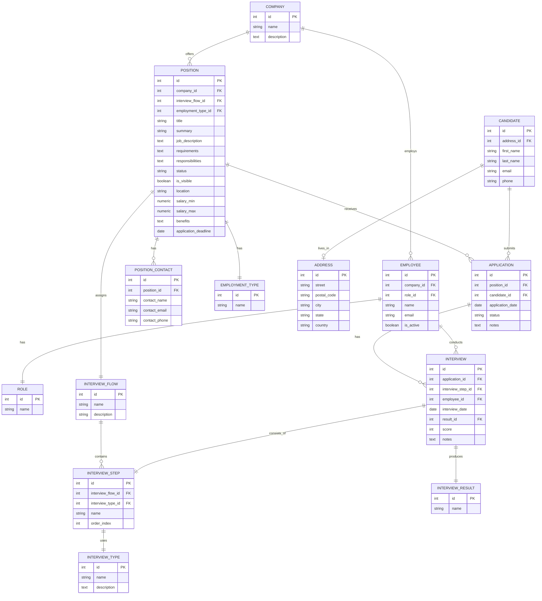

```mermaid
erDiagram
    COMPANY {
        int id PK
        string name
        text description
    }
    EMPLOYEE {
        int id PK
        int company_id FK
        int role_id FK
        string name
        string email
        boolean is_active
    }
    ROLE {
        int id PK
        string name
    }
    POSITION {
        int id PK
        int company_id FK
        int interview_flow_id FK
        int employment_type_id FK
        string title
        string summary
        text job_description
        text requirements
        text responsibilities
        string status
        boolean is_visible
        string location
        numeric salary_min
        numeric salary_max
        text benefits
        date application_deadline
    }
    POSITION_CONTACT {
        int id PK
        int position_id FK
        string contact_name
        string contact_email
        string contact_phone
    }
    EMPLOYMENT_TYPE {
        int id PK
        string name
    }
    INTERVIEW_FLOW {
        int id PK
        string name
        string description
    }
    INTERVIEW_STEP {
        int id PK
        int interview_flow_id FK
        int interview_type_id FK
        string name
        int order_index
    }
    INTERVIEW_TYPE {
        int id PK
        string name
        text description
    }
    ADDRESS {
        int id PK
        string street
        string postal_code
        string city
        string state
        string country
    }
    CANDIDATE {
        int id PK
        int address_id FK
        string first_name
        string last_name
        string email
        string phone
    }
    APPLICATION {
        int id PK
        int position_id FK
        int candidate_id FK
        date application_date
        string status
        text notes
    }
    INTERVIEW {
        int id PK
        int application_id FK
        int interview_step_id FK
        int employee_id FK
        date interview_date
        int result_id FK
        int score
        text notes
    }
    INTERVIEW_RESULT {
        int id PK
        string name
    }

    COMPANY ||--o{ EMPLOYEE : employs
    COMPANY ||--o{ POSITION : offers
    EMPLOYEE ||--|| ROLE : has
    POSITION ||--|| INTERVIEW_FLOW : assigns
    POSITION ||--|| EMPLOYMENT_TYPE : has
    POSITION ||--o{ POSITION_CONTACT : has
    INTERVIEW_FLOW ||--o{ INTERVIEW_STEP : contains
    INTERVIEW_STEP ||--|| INTERVIEW_TYPE : uses
    POSITION ||--o{ APPLICATION : receives
    CANDIDATE ||--o{ APPLICATION : submits
    CANDIDATE ||--o| ADDRESS : lives_in
    APPLICATION ||--o{ INTERVIEW : has
    INTERVIEW ||--|| INTERVIEW_STEP : consists_of
    INTERVIEW ||--|| INTERVIEW_RESULT : produces
    EMPLOYEE ||--o{ INTERVIEW : conducts
```
